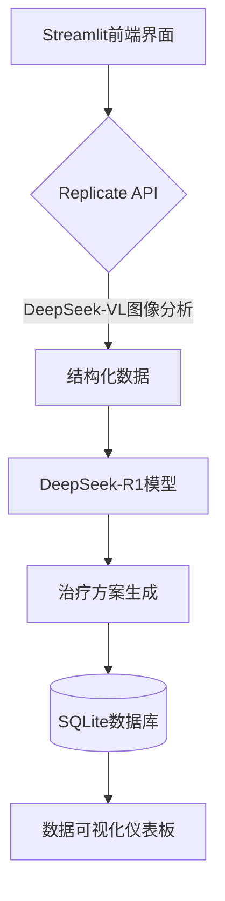

# AI医美智能评估系统技术方案

## 系统架构


## 核心功能实现

### 图像分析模块
```python
import replicate
import cv2

def analyze_facial_features(image_path):
    """使用DeepSeek-VL进行面部特征分析"""
    # 图像匿名化处理
    img = cv2.imread(image_path)
    img = cv2.cvtColor(img, cv2.COLOR_BGR2RGB)
    
    # 调用Replicate API
    output = replicate.run(
        "deepseek-ai/deepseek-vl2:7b-v2.0.0",
        input={
            "image": open(image_path, "rb"),
            "task": "skin_analysis",
            "language": "zh-CN"
        }
    )
    return output
```

### 智能建议生成
```python
import requests

def generate_treatment_plan(analysis_data):
    """调用DeepSeek-R1生成医美方案"""
    headers = {
        "Authorization": "Bearer ${DEEPSEEK_API_KEY}",
        "Content-Type": "application/json"
    }
    
    prompt_template = f'''
    作为资深医美专家，请根据以下分析结果：
    {analysis_data}
    
    生成包含：
    1. 优先推荐治疗方案（使用中文专业术语）
    2. 预期改善效果
    3. 术后护理注意事项
    4. 风险提示说明
    '''
    
    response = requests.post(
        "https://api.deepseek.com/v1/chat/completions",
        headers=headers,
        json={
            "model": "deepseek-r1",
            "messages": [{
                "role": "user",
                "content": prompt_template
            }],
            "temperature": 0.3
        }
    )
    return response.json()
```

## 实施路线图

| 阶段 | 时间 | 关键交付物 | 完成标准 |
|------|------|------------|----------|
| 环境配置 | 2天 | API密钥管理系统 | 实现密钥轮换与加密存储 |
| 核心流水线 | 5天 | 完整分析链路 | 端到端响应时间＜3秒 |
| 术语本地化 | 3天 | 中文医疗术语库 | 覆盖200+专业术语 |
| 安全加固 | 2天 | 数据加密模块 | 通过HIPAA模拟审计 |

## 数据管理规范
1. 图像存储：加密后保存7天自动清除
2. 分析报告：匿名化存储至SQLite
3. 审计日志：记录所有API调用记录

## 系统部署要求
- 最低硬件配置：4核CPU/8GB内存/50GB存储
- 推荐网络带宽：≥100Mbps
- 依赖服务：Replicate API/DeepSeek API端点
